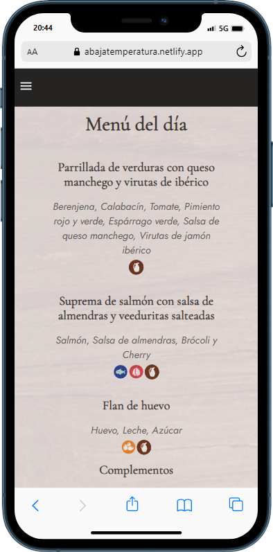
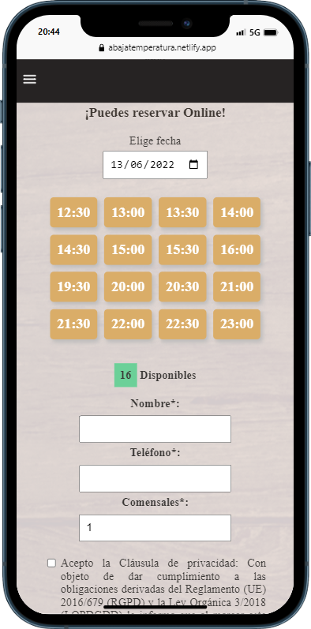

# A baja temperatura

App de un restaurante ficticio.
Esta incluye apartado para reservar mesa.
La reservas no utiliza ninguna libreria.
Los datos son alojados en firebase.

## Tabla de contenidos
- [Vista general](#vista-general)
  - [Enlace a la web](#enlace-a-la-web)
  - [Capturas en ordenador](#capturas-en-ordenador)
  - [Capturas en móvil](#capturas-en-móvil)
- [Desarrollo](#desarrollo)
  - [Tecnologías](#tecnologías)
  - [Reproducir en local](#reproducir-en-local)
- [Autor](#autor)
- [Recommended IDE Setup](#recommended-ide-setup)

## Vista General
### Enlace a la web
Descubre A baja temperatura en:
https://abajatemperatura.netlify.app/

### Capturas en ordenador


### Capturas en móvil



## Desarrollo
### Tecnologías
- Maquetación: HTML5
- Estilos: Sass
- Funcionalidad: VueJS, Vue Router y VueX
- Empaquetador: Vite
- Librerias: Axios, Toastification, i18n

### Reproducir en local
Clona el proyecto
```
  git clone https://github.com/geminway92/a-baja-temperatura
```
Entra en la carpeta
```
  cd a-baja-temperatura
```
Instala las dependencias del proyecto
```
  npm install
```
Construye el proyecto
```
  npm run build
```
Inicia el proyecto en local
```
  npm run dev
```

## Autor
- [Gema Martín](https://github.com/geminway92)


## Recommended IDE Setup

- [VS Code](https://code.visualstudio.com/) + [Volar](https://marketplace.visualstudio.com/items?itemName=Vue.volar)
